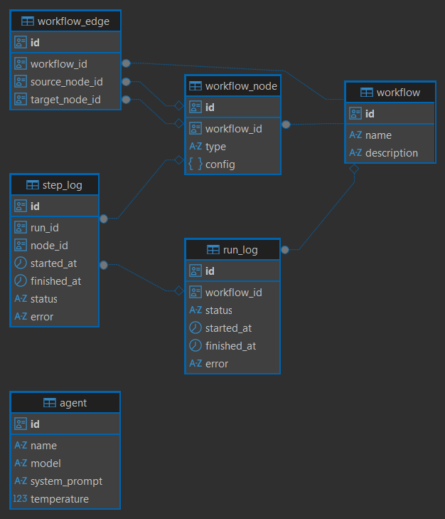

# Design Documentation

## Database

**Entity Relationship Diagram**:\
Screenshot generated using DBeaver.

\
**Some observations**:
- Why is the `Agent` table not referenced by other tables? This is because of two reasons. First, other tables simply have no need to reference it. Second, in `workflow_node`, we don't want to store a foreign key to some `Agent` because my intuition says that a single node should not be concerned with a particular data. Instead, it should be general enough such that we can easily assign/update/remove data without affecting the table schema.
- For this reason, I added `config` column in `workflow_node` table. This column should contain a json string (or binary) for any arbitrary data on a particular node. So, to reference an `Agent`, we can do it here.
- Input and output of each nodes are not saved to the execution log, this is to minimize possible storage bloat.

**Things I would like to improve**:\
Currently this database design presents some flaws.
- Node `type` is an enum, we can't easily add more types in the future other than changing this enum. In Postgres, adding more types requires altering of the assoociated enum data type. When given more time, I would like to add a new `node_type` table that will hold node type records.
- Similarly, agent `model` is an enum, can't easily add more or change it. A dedicated `model` table would benefit from easy management and model metadata storage.